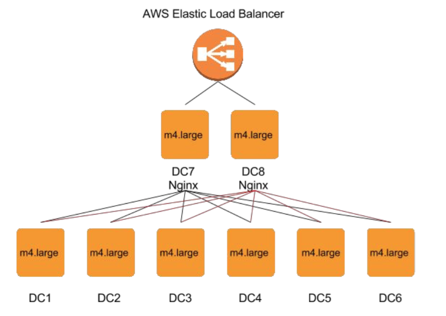

# Twitter Analytics on the Cloud #

The team project of course 15-619 at CMU. By Team CodingSquirrels: Haibin Lin, Aaron Chen and Hechao Li.

### Challenges ###

* Implement Extract Transform and Load (ETL) on a large data set (~ 1 TB) and load into MySQL and HBase systems.
* Design and optimize MySQL and HBase databases to deal with scale and improve throughput.
* Explore and utilize various methods and tools to improve the performance of a complete web service.
* Develop consistent servers to handle write queries, range queries and read queries.

### Tech Stack ###

* Extract and transform with AWS Elastic MapReduce
* Load balance web traffic with AWS Elastic Load Balancer and Nginx proxy server
* Handle web request with Vert.x web server
* Load data with MySQL and Apache HBase  

### Architecture ###

